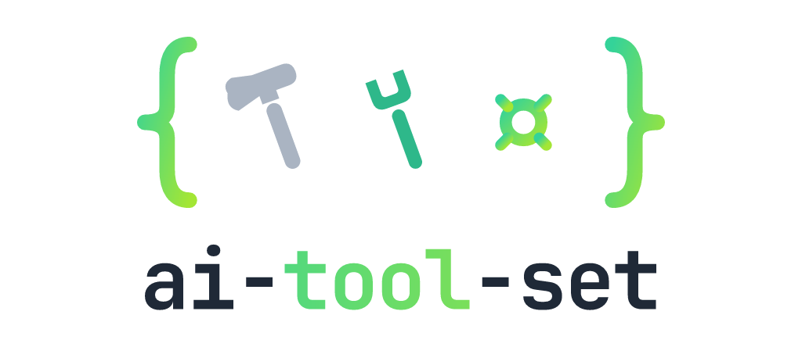

<div align='center'>

<picture>
  <source media="(prefers-color-scheme: dark)" srcset="assets/logo-dark.png" />
  
</picture>

<p align="center">Conditional tool activation for the AI SDK, fully type-safe</p>
<p align="center">
  <a href="https://www.npmjs.com/package/ai-tool-set" alt="ai-tool-set"></a> <a href="https://github.com/zirkelc/ai-tool-set/actions/workflows/ci.yml" alt="CI"></a>
</p>

</div>

This library provides a type-safe API to manage [`activeTools`](https://ai-sdk.dev/docs/reference/ai-sdk-core/generate-text#active-tools) and [`toolApproval`](https://ai-sdk.dev/docs/agents/tool-approvals) for [`generateText()`](https://ai-sdk.dev/docs/reference/ai-sdk-core/generate-text) and [`streamText()`](https://ai-sdk.dev/docs/reference/ai-sdk-core/stream-text) in the AI SDK.

### Why?

The AI SDK provides an `activeTools` parameter to control which tools the model can use, and a `toolApproval` parameter to gate tool execution. However, managing this becomes complex when you need to:

- **Statically activate/deactivate tools**: Some tools should be inactive by default and only available after being explicitly activated
- **Dynamically infer tool activation**: Some tools should be activated based on runtime context like the conversation history
- **Control tool approval**: Some tools should require human approval, or be auto-approved or denied based on context

This library wraps standard AI SDK `tool()` definitions with chainable activation and approval methods, and resolves `tools`, `activeTools`, and `toolApproval` for any AI SDK function.

### Installation

> [!NOTE]
> Version compatibility:
>
> - Use [`ai-tool-set@1.x`](https://github.com/zirkelc/ai-tool-set/tree/v1.x) for AI SDK v6 (provider spec `v3`)
> - Use [`ai-tool-set@next`](https://github.com/zirkelc/ai-tool-set/tree/next) for AI SDK v7 (provider spec `v4`)

```bash
npm install ai-tool-set
```

## Usage

### Creating a Tool Set

Pass a plain record of AI SDK `tool()` definitions to `createToolSet()`. All tools are active by default.

```typescript
import { tool } from 'ai';
import { z } from 'zod';
import { createToolSet } from 'ai-tool-set';

const tools = {
  search: tool({
    description: 'Search for products',
    inputSchema: z.object({ query: z.string() }),
    execute: async ({ query }) => searchProducts(query),
  }),
  list_orders: tool({
    description: 'List orders for a customer',
    inputSchema: z.object({ customerId: z.string() }),
    execute: async ({ customerId }) => listOrders(customerId),
  }),
  cancel_order: tool({
    description: 'Cancel an order',
    inputSchema: z.object({ orderId: z.string() }),
    execute: async ({ orderId }) => cancelOrder(orderId),
  }),
};

const toolSet = createToolSet({ tools });
```

### Activate and Deactivate Tools

Use `.activate()` and `.deactivate()` to statically control which tools are available. Call `.inferTools()` to resolve `activeTools` and pass into `generateText()` or `streamText()`:

```typescript
import { generateText } from 'ai';

// Activate and deactivate tools
const toolSet = createToolSet({ tools }).deactivate(['cancel_order']).activate(['list_orders']);

// Infer active tools
const { tools, activeTools } = toolSet.inferTools();

const result = await generateText({
  model,
  // Pass tools and activeTools:
  tools,
  activeTools,
  // Or spread directly:
  // ...toolSet.deactivate(['cancel_order']).activate(['list_orders']).inferTools(),
  prompt: 'Show me my orders',
});
```

### Conditional Activation

Use `.activateWhen()` and `.deactivateWhen()` to conditionally control tools based on messages and context. The predicate receives an input with `messages` and `toolSetContext` (both can be `undefined` if not provided to `inferTools`) and should return a boolean (or undefined) to determine whether the tool should be activated/deactivated.

```typescript
// Conditional activation with a predicate that checks for unfulfilled orders in the messages
const toolSet = createToolSet({ tools })
  .activateWhen('list_orders', ({ toolSetContext }) => toolSetContext?.isAuthenticated)
  .activateWhen('cancel_order', ({ messages }) =>
    messages?.some((m) =>
      m.parts.some(
        (p) =>
          p.type === 'tool-list_orders' &&
          p.state === 'output-available' &&
          p.output.orders?.some((order) => order.status !== 'fulfilled'),
      ),
    ),
  );
```

Call `.inferTools()` with messages and/or `toolSetContext` to evaluate activation predicates and resolve `activeTools`:

```typescript
const messages = [
  {
    role: 'user',
    parts: [{ type: 'text', text: 'Show me my orders' }],
  },
  {
    role: 'assistant',
    parts: [
      {
        type: 'tool-list_orders',
        state: 'output-available',
        toolCallId: 'call-1',
        input: { customerId: 'cust-123' },
        output: {
          orders: [
            { orderId: '1000', status: 'fulfilled' },
            { orderId: '1001', status: 'pending' },
          ],
        },
      },
    ],
  },
];

const toolSetContext = { isAuthenticated: true };

// cancel_order is now active because list_orders returned unfulfilled orders
const { tools, activeTools } = toolSet.inferTools({ messages, toolSetContext });

const result = await generateText({ model, tools, activeTools, messages });
```

You can also activate multiple tools at once:

```typescript
const toolSet = createToolSet({ tools }).activateWhen({
  list_orders: ({ toolSetContext }) => toolSetContext?.isAuthenticated,
  cancel_order: ({ messages }) => hasUnfulfilledOrders(messages),
});
```

### Activation Defaults

`.activateWhen()` marks a tool as **inactive by default**. It only becomes active when the predicate returns `true`. If the predicate returns `undefined` or `false`, the tool stays inactive:

```typescript
const toolSet = createToolSet({ tools })
  // undefined when messages is not provided → tool stays inactive
  // false when no orders found → tool stays inactive
  // true when orders found → tool becomes active
  .activateWhen('cancel_order', ({ messages }) => messages?.some((m) => hasOrders(m)));

toolSet.inferTools().activeTools; // cancel_order is inactive (predicate received undefined)
toolSet.inferTools({ messages: [] }).activeTools; // cancel_order is inactive (no orders)
```

`.deactivateWhen()` marks a tool as **active by default**. It only becomes inactive when the predicate returns `true`. If the predicate returns `undefined` or `false`, the tool stays active:

```typescript
const toolSet = createToolSet({ tools })
  // undefined when messages is not provided → tool stays active
  // false when few messages → tool stays active
  // true when too many messages → tool becomes inactive
  .deactivateWhen('search', ({ messages }) => messages && messages.length > 10);

toolSet.inferTools().activeTools; // search is active (predicate received undefined)
toolSet.inferTools({ messages: [] }).activeTools; // search is active (few messages)
```

### Last-Call Wins

Each activation method appends to an internal list. For each tool, the **last entry** determines its state. This makes ordering explicit and predictable:

```typescript
const toolSet = createToolSet({ tools })
  // cancel_order: activated
  .activate(['cancel_order'])
  // cancel_order: deactivated
  .deactivate(['cancel_order'])
  // cancel_order: deactivated with conditional activation
  .activateWhen('cancel_order', ({ messages }) => hasUnfulfilledOrders(messages));
```

### Tool Approval

> [!NOTE]
> Tool approval requires AI SDK v7 (`ai-tool-set@2.x`).

The AI SDK can gate tool execution with [`toolApproval`](https://ai-sdk.dev/docs/agents/tool-approvals). `.inferTools()` resolves a `toolApproval` record alongside `tools` and `activeTools`, so a single tool set drives both activation and approval.

Use `.approve()` and `.deny()` for static decisions, and `.approval()` for dynamic ones:

```typescript
const toolSet = createToolSet({ tools })
  // Always auto-approve
  .approve(['list_orders'])
  // Always require human approval
  .approval('cancel_order', 'user-approval')
  // Decide dynamically from the toolset context
  .approval('search', ({ toolSetContext }) => (toolSetContext?.isAdmin ? 'approved' : 'denied'));

const { tools, activeTools, toolApproval } = toolSet.inferTools({ toolSetContext: { isAdmin: false } });

const result = await generateText({ model, tools, activeTools, toolApproval, prompt: 'Cancel order 1001' });
```

A tool with no approval entry defaults to `'not-applicable'` (runs without approval). Approval resolution follows the same **last-call wins** rule as activation.

An `.approval()` entry is either a constant [`ToolApprovalStatus`](https://ai-sdk.dev/docs/agents/tool-approvals) (`'approved'`, `'denied'`, `'user-approval'`, `'not-applicable'`) or a **resolver**. The resolver runs inside `.inferTools()` with your toolset values (`{ messages, toolSetContext }`) and returns either:

- a final status decided right there, or
- a [`SingleToolApprovalFunction`](https://ai-sdk.dev/docs/agents/tool-approvals) deferred to tool-call time, which the AI SDK invokes with the tool input and its own runtime values (`runtimeContext`, model messages, tool context).

This two-layer shape keeps the two contexts distinct: `toolSetContext` (yours, available now in `inferTools`) versus the AI SDK's `runtimeContext` (live at tool-call time). Decide with what you know up front, and defer to the live tool input when you don't:

```typescript
type ToolSetContext = { isAdmin: boolean };
type RuntimeContext = { region: string };

const toolSet = createToolSet<typeof tools, MyUIMessage, ToolSetContext, RuntimeContext>({ tools }).approval(
  'cancel_order',
  ({ toolSetContext }) =>
    // Decide now from the toolset context...
    toolSetContext?.isAdmin
      ? 'approved'
      : // ...or defer to the AI SDK with the actual tool input + runtime context
        (input, { runtimeContext }) =>
          input.orderId.startsWith('eu-') && runtimeContext.region === 'eu' ? 'approved' : 'user-approval',
);
```

### Immutable vs Mutable

By default, `createToolSet()` returns an **immutable** tool set, that means every method returns a new instance and the original is never modified. This is ideal when the tool set is created once in the global scope and shared across requests:

```typescript
// Global scope: created once, shared across requests
const toolSet = createToolSet({ tools }).deactivate(['list_order', 'cancel_order']);

export async function POST(req: Request) {
  const { messages } = await req.json();

  // Activate list_orders only for this request
  // myToolSet !== toolSet, original toolSet is unchanged for next request
  const myToolSet = toolSet.activate(['list_orders']);

  const result = await generateText({
    model,
    ...myToolSet.inferTools({ messages }),
    messages,
  });
}
```

Use `createToolSet({ mutable: true })` to get a **mutable** tool set where each method mutates in-place and returns `this` for chaining. This is useful when the tool set is created per-request in a local scope:

```typescript
export async function POST(req: Request) {
  const { messages } = await req.json();

  // Local scope: created and mutated per request
  const toolSet = createToolSet({ tools, mutable: true })
    .deactivate(['list_order', 'cancel_order'])
    .activate(['list_orders']);

  const result = await generateText({
    model,
    ...toolSet.inferTools({ messages }),
    messages,
  });
}
```

### Cloning

Use `.clone({ mutable?: boolean })` to convert between immutable and mutable, preserving all activation entries:

```typescript
// Convert an immutable toolset to mutable
const mutableToolSet = toolSet.clone({ mutable: true });

// Convert a mutable toolset back to immutable
const immutableToolSet = mutableToolSet.clone();
```

This is useful when you want to create a base tool set in the global scope and clone it per request to add request-specific activation:

```typescript
// Global scope: base tool set
const baseToolSet = createToolSet({ tools }).deactivate(['list_order', 'cancel_order']);

export async function POST(req: Request) {
  const { messages } = await req.json();

  // Clone the base tool set into a mutable instance for this request
  const toolSet = baseToolSet.clone({ mutable: true });

  // Activate list_orders only for this request
  toolSet.activate(['list_orders']);

  const result = await generateText({
    model,
    ...toolSet.inferTools({ messages }),
    messages,
  });
}
```

### Typed UI Tool Set

Use `InferUIToolSet` to get fully typed UI messages from your tool set:

```typescript
import type { UIMessage } from 'ai';
import type { InferUIToolSet } from 'ai-tool-set';

const tools = { search, list_orders, cancel_order };
const toolSet = createToolSet({ tools });

// From the tools record
type MyToolSet = InferUIToolSet<typeof tools>;

// Or from the ToolSet instance
type MyToolSet = InferUIToolSet<typeof toolSet>;

// Use MyToolSet in your UIMessage type for type-safe access to tool invocation parts:
type MyUIMessage = UIMessage<unknown, any, MyToolSet>;
```

### Custom UIMessage

If you already have a custom `UIMessage` type, you can pass it as `MESSAGE` generic to `createToolSet()` and it will be used in predicates and `inferTools`:

```typescript
import { myTools } from './my-tools.js';
import { MyUIMessage } from './my-ui-message.js';

const toolSet = createToolSet<typeof myTools, MyUIMessage>({ tools: myTools }).activateWhen(
  'cancel_order',
  ({ messages }) => hasUnfulfilledOrders(messages),
  // ~~~~~~~~
  // Messages are now typed as Array<MyUIMessage> | undefined
);

const { tools, activeTools } = toolSet.inferTools({ messages });
```

### Custom Context

The AI SDK has its own [`runtimeContext`](https://ai-sdk.dev/docs/ai-sdk-core/runtime-and-tool-context#runtime-context) and [`toolsContext`](https://ai-sdk.dev/docs/ai-sdk-core/runtime-and-tool-context#tool-context) that flow through generation and are available at tool-call time. `toolSetContext` is this library's own context, evaluated at `.inferTools()` time. It can share the shape of your AI SDK `runtimeContext`, or be something completely different.

Pass a `TOOLSET_CONTEXT` generic to `createToolSet()` to type the `toolSetContext` field in predicates, approval resolvers, and `inferTools`:

```typescript
import { myTools } from './my-tools.js';
import { MyUIMessage } from './my-ui-message.js';

type MyToolSetContext = { userId: string; isAdmin: boolean };

const toolSet = createToolSet<typeof myTools, MyUIMessage, MyToolSetContext>({ tools: myTools }).activateWhen(
  'cancel_order',
  ({ toolSetContext }) => toolSetContext?.isAdmin,
  // ~~~~~~~~~~~~~~
  // toolSetContext is typed as MyToolSetContext | undefined
);

const { tools, activeTools } = toolSet.inferTools({
  messages,
  toolSetContext: { userId: '1', isAdmin: true },
});
```

A fourth `RUNTIME_CONTEXT` generic types the AI SDK `runtimeContext` that a deferred approval function receives at tool-call time (defaults to `unknown`). It is separate from `toolSetContext` and is passed to `generateText()` as a plain value:

```typescript
type RuntimeContext = { region: string };

const toolSet = createToolSet<typeof myTools, MyUIMessage, MyToolSetContext, RuntimeContext>({
  tools: myTools,
}).approval(
  'cancel_order',
  () =>
    (input, { runtimeContext }) =>
      runtimeContext.region === 'eu' ? 'user-approval' : 'approved',
  //                  ~~~~~~~~~~~~~~
  //                  runtimeContext is typed as RuntimeContext
);

// Pass the matching runtimeContext to generateText — the AI SDK forwards it to the deferred function
const result = await generateText({
  model,
  ...toolSet.inferTools(),
  runtimeContext: { region: 'eu' },
  prompt: 'Cancel order eu-1001',
});
```

## API

## `createToolSet(options)`

- `options.tools`, a plain `Record<string, Tool>` of AI SDK tools
- `options.mutable` (optional), set to `true` for a mutable tool set (default: `false`)

Returns a `ToolSet` instance. All tools are active by default.

```ts
const toolSet = createToolSet({ tools: { search, list_orders, cancel_order } });

// Mutable mode — methods mutate in-place and return `this`
const toolSet = createToolSet({ tools: { search, list_orders, cancel_order }, mutable: true });
```

#### `.tools`

All tools as a standard AI SDK tool record, regardless of activation state.

```ts
const { tools } = toolSet;
```

#### `.activate(names)`

Statically activate tools by name. Returns a new instance (immutable) or `this` (mutable).

```ts
toolSet.activate(['cancel_order']);
```

#### `.deactivate(names)`

Statically deactivate tools by name. Returns a new instance (immutable) or `this` (mutable).

```ts
toolSet.deactivate(['search']);
```

#### `.activateWhen(name, predicate)` / `.activateWhen(predicates)`

Conditionally activate tools. The predicate receives `{ messages, toolSetContext }` and returns `true` to activate. Both `messages` and `toolSetContext` can be `undefined` if not provided to `inferTools`. Returning `undefined` is treated as `false`.

```ts
toolSet.activateWhen('cancel_order', ({ messages }) => messages?.some((m) => hasOrders(m)));

toolSet.activateWhen({
  cancel_order: ({ messages }) => messages?.some((m) => hasOrders(m)),
  list_orders: ({ toolSetContext }) => toolSetContext?.isAuthenticated,
});
```

#### `.deactivateWhen(name, predicate)` / `.deactivateWhen(predicates)`

Conditionally deactivate tools. The predicate receives `{ messages, toolSetContext }` and returns `true` to deactivate. Both `messages` and `toolSetContext` can be `undefined` if not provided to `inferTools`. Returning `undefined` is treated as `false` (tool stays active).

```ts
toolSet.deactivateWhen('search', ({ messages }) => messages && messages.length > 10);
```

#### `.approve(names)`

Statically approve tools by name (status `'approved'`). Returns a new instance (immutable) or `this` (mutable).

```ts
toolSet.approve(['list_orders']);
```

#### `.deny(names)`

Statically deny tools by name (status `'denied'`). Returns a new instance (immutable) or `this` (mutable).

```ts
toolSet.deny(['cancel_order']);
```

#### `.approval(name, entry)` / `.approval(entries)`

Set a tool's approval to a constant `ToolApprovalStatus` or a resolver. A resolver receives `{ messages, toolSetContext }` and returns either a final status or a `SingleToolApprovalFunction` that the AI SDK calls at tool-call time. Last-call wins.

```ts
// Constant status
toolSet.approval('cancel_order', 'user-approval');

// Resolver — decide from the toolset context
toolSet.approval('cancel_order', ({ toolSetContext }) => (toolSetContext?.isAdmin ? 'approved' : 'user-approval'));

// Resolver — defer to the AI SDK with the tool input + runtime context
toolSet.approval(
  'cancel_order',
  () =>
    (input, { runtimeContext }) =>
      input.orderId ? 'approved' : 'denied',
);

// Multiple tools at once
toolSet.approval({
  search: 'approved',
  cancel_order: ({ toolSetContext }) => (toolSetContext?.isAdmin ? 'approved' : 'denied'),
});
```

#### `.inferTools(input?)`

Evaluate all predicates and approval resolvers and return `{ tools, activeTools, toolApproval }`, directly spreadable into `generateText()` or `streamText()`. The input is optional; all fields are optional. Predicates and resolvers receive `undefined` for fields not provided.

- `input` (optional):
  - `messages` (optional), the current conversation messages
  - `toolSetContext` (optional), arbitrary values passed to predicates and approval resolvers

```ts
// Static-only (no predicates)
const { tools, activeTools, toolApproval } = toolSet.inferTools();

// With messages
const { tools, activeTools, toolApproval } = toolSet.inferTools({ messages });

// With toolSetContext
const { tools, activeTools, toolApproval } = toolSet.inferTools({ toolSetContext: { isAdmin: true } });

// With both
const { tools, activeTools, toolApproval } = toolSet.inferTools({ messages, toolSetContext });

const result = await generateText({ model, tools, activeTools, toolApproval, messages });
```

#### `.clone(options?)`

Clone the toolset, preserving all activation entries. Pass `{ mutable: true }` to get a mutable clone, or omit for an immutable clone. Defaults to immutable.

```ts
const mutableClone = toolSet.clone({ mutable: true });
const immutableClone = toolSet.clone();
```

## Types

### `InferToolsInput`

Input passed to `inferTools()`, activation predicates, and approval resolvers. Generic over `MESSAGE` and `TOOLSET_CONTEXT`. Both `messages` and `toolSetContext` are optional since they may not be provided to `inferTools`:

```ts
import type { InferToolsInput } from 'ai-tool-set';

type MyInput = InferToolsInput<MyUIMessage, { isAdmin: boolean }>;
// { messages?: Array<MyUIMessage>; toolSetContext?: { isAdmin: boolean } }
```

### `ToolSet`

Parameter type that accepts both immutable and mutable variants of an existing tool set. Use it for helpers that should work regardless of which flavor the caller is holding:

```ts
import { createToolSet, type ToolSet } from 'ai-tool-set';

const toolSet = createToolSet({ tools }).deactivate(['cancel_order']);

type MyToolSet = ToolSet<typeof toolSet>;

// Accepts the immutable toolset AND the cloned mutable instance
function activateTools(toolSet: MyToolSet) {
  toolSet.activate(['cancel_order']);
}

activateTools(toolSet);

const mutableToolSet = toolSet.clone({ mutable: true });
activateTools(mutableToolSet);
```

### `ApprovalResolver`

The function form of an approval entry. Runs inside `inferTools()` with `{ messages, toolSetContext }` and returns either a final `ToolApprovalStatus` or a `SingleToolApprovalFunction` (from `ai`) deferred to tool-call time. Generic over the tool, `MESSAGE`, `TOOLSET_CONTEXT`, and the AI SDK `RUNTIME_CONTEXT` (defaults to `unknown`):

```ts
import type { ApprovalResolver } from 'ai-tool-set';

const resolver: ApprovalResolver<typeof cancelOrderTool> = ({ toolSetContext }) =>
  toolSetContext?.isAdmin ? 'approved' : 'user-approval';
```

### `ApprovalEntry`

A tool's approval value accepted by `.approval()`: a constant `ToolApprovalStatus` or an `ApprovalResolver`.

```ts
import type { ApprovalEntry } from 'ai-tool-set';

const entry: ApprovalEntry<typeof cancelOrderTool> = 'user-approval';
```

### `InferToolSet`

Extract the raw tool record from a tool record or `ToolSet` instance:

```ts
import type { InferToolSet } from 'ai-tool-set';

type Tools = InferToolSet<typeof toolSet>;
// { search: Tool<...>, list_orders: Tool<...>, cancel_order: Tool<...> }
```

### `InferUIToolSet`

Derive typed UI tool parts from a tool record or `ToolSet` instance. Use with `UIMessage` for type-safe access to tool invocation parts:

```ts
import type { UIMessage } from 'ai';
import type { InferUIToolSet } from 'ai-tool-set';

type MyUIMessage = UIMessage<unknown, any, InferUIToolSet<typeof toolSet>>;

// Parts are now typed per tool:
// message.parts[0].type === 'tool-search'
// message.parts[0].output // typed as search tool's return type
```

### `InferActiveTools`

Extract the tool names tracked as active from an immutable `ToolSet` instance. Tracks tools from `.activate()` and `.deactivateWhen()`.

> [!NOTE]
> `InferActiveTools` returns `never` for mutable toolsets, since TypeScript cannot track type changes on the same reference across method calls.

```ts
import type { InferActiveTools } from 'ai-tool-set';

const toolSet = createToolSet({ tools }).deactivate(['cancel_order']);

type Active = InferActiveTools<typeof toolSet>;
// 'search' | 'list_orders'
```

### `InferInactiveTools`

Extract the tool names tracked as inactive from an immutable `ToolSet` instance. Tracks tools from `.deactivate()` and `.activateWhen()`.

> [!NOTE]
> `InferInactiveTools` returns `never` for mutable toolsets, since TypeScript cannot track type changes on the same reference across method calls.

```ts
import type { InferInactiveTools } from 'ai-tool-set';

const toolSet = createToolSet({ tools }).deactivate(['cancel_order']);

type Inactive = InferInactiveTools<typeof toolSet>;
// 'cancel_order'
```

### `InferAllTools`

Extract all tool names from a `ToolSet` instance, regardless of activation state. Works for both immutable and mutable toolsets since the tool record is statically known.

```ts
import type { InferAllTools } from 'ai-tool-set';

const toolSet = createToolSet({ tools }).deactivate(['cancel_order']);

type All = InferAllTools<typeof toolSet>;
// 'search' | 'list_orders' | 'cancel_order'
```

## License

MIT
